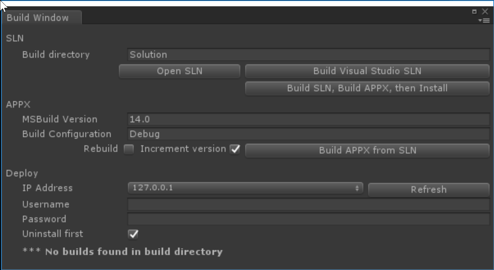

# Deployment

## Goals

* Build a Visual Studio solution
* Deploy the solution to the HoloLens Emulator
* Realize that deployment is slow, and it's better to stay in Unity
* Get it into source control (git) appropriately.

## Build the solution

1. Open the `HoloToolkit` menu
2. Choose `Build Window`



3. Click `Build Visual Studio SLN`
4. Wait
5. Click `Open SLN`

This builds all the solutiony stuff you need to deploy to the device. I use the folder name `Solution` to make it clear that's the Visual Studio solution.  Handily, that's the default - how clever!

## Deploy the solution

In Visual Studio, set your build configuration to:

* Release
* x86
* HoloLens Emulator

Hit `Ctrl+F5` to run without debugging.  Wait a long time, and you're off to the races!

## Troubleshooting

This part often has lots of issues.  To save time, I've developed a self-learning artificial intelligence to troubleshoot these issues, and embedded it below.  This system  detects the problem you are having, reticulates the splines and adjusts its parameters to generate a specific solution to your problem.  Here it is:

1. Close Visual Studio
2. Delete the `Solution` folder
3. Run all the above steps again

## Using the Emulator

Navigation in the emulator:

* Walking: WASD
* Looking: Left-mouse drag
* "Tap" gesture: Right-click
* "Bloom" gesture: Windows key

If you put your face close enough to the screen, it feels _just like_ wearing a HoloLens.

It doesn't really, don't do that - you'll jusut look silly and get a bit of eye strain. Seriously.

## Should I use it?

Short answer: No.

You will spend over 95% of your development time is in Unity or your script editor of choice (often Visual Studio) - deploying to the emulator or a Hololens is just the last thing you do to verify something works well with real input.

The one exception to this is dealing with Spatial Anchors, but we'll cover that later.

It is exciting at first to see your work on an actual device, but it's just too slow to be worth it.  You'll get sick of waiting, trust me.

Stay in Unity and you'll be happier for it.

## A note on source control

The main take-home on `.gitignore` is to **ignore all Unity generated output** - this includes the Visual Studio solution.  Checking that in will lead to pain.

Here is a `.gitignore` I've used with success.  I have no idea where I got it from, or what changes I've made to it:

```sh
/[S]olution/
/[Ll]ibrary/
/[Tt]emp/
/[Oo]bj/
/[Bb]uild/
/[Bb]uilds/
/Assets/AssetStoreTools*
/UWP/

# Autogenerated VS/MD/Consulo solution and project files
ExportedObj/
.consulo/
*.csproj
*.unityproj
*.sln
*.suo
*.tmp
*.user
*.userprefs
*.pidb
*.booproj
*.svd
.vs/
[Ee]xported[Oo]bj/

# Unity3D generated meta files
*.pidb.meta

# Unity3D Generated File On Crash Reports
sysinfo.txt

# Builds
*.apk
*.unitypackage
Solution
project.lock.json
```

---
Next: [Spatial Mapping](/2-spatial-mapping/index.md)

Prev: [Creating the scene](4-create-the-scene.md)