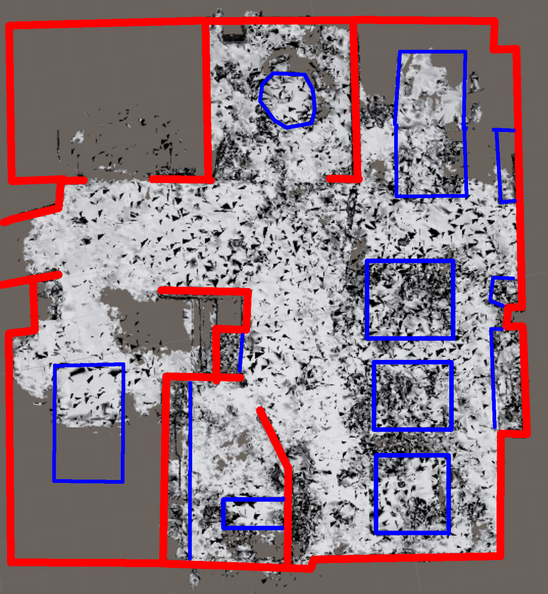

# Fake Room Data

#3 Goals

* Add fake room data to our assets

## 1. Getting room data

Just by importing HoloToolkit, you will have a nice and simple room mesh called `FakeSpatialMappingMesh`. 

If you want more, there are some options:

Microsoft ship a few rooms with their HoloLens SDK, which can be found here:

```
C:\Program Files (x86)\Microsoft XDE\10.0.14393.0\Plugins\Rooms
```

I like `Great Room` because it's wide open.

Alternatively, I have put a mesh up of the <a href="/assets/rooms/ReadifyOffice.obj" target="_blank" download>Readify office</a> - (TODO: Right-click, save as) this is a little more real-world in that it is patchy, and has incompletely mapped sections.  It's  bigger than the ones shipped in the SDK too, which is useful - though the presence of things like chairs, umbilical cords and people can make it confusing.



## 2. Adding the room mesh to your assets

1. Add a folder to your assets called `RoomMeshes`.
2. Drag-drop the rooms you like into here.  Alternatively, copy/paste them into the folder on the file system - Unity will pick it up for you
  * This can take a little while, be patient, there are a lot of triangles.
3. As a quick verify, drag the mesh onto a scene - you should see the room mesh display. If you do this, don't forget to delete it - we will be using it via the spatial mapper instead.

Note at this point, it's just a static mesh, like the cube we had on earlier.  However, in the next part we will use this mesh to simulate spatial mapping while in the Unity editor.

---
Next: [Using Spatial Mapper](2-using-spatial-mapper.md)

Prev: [Spatial Mapping](index.md)