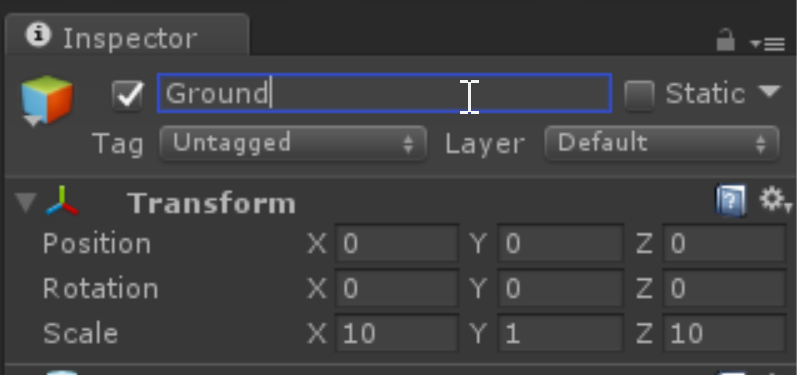

# Unity Configuration / Overview

## Goals

* Launch Unity
* Create a Unity project
* Configure Unity layout to one better for this workshop
* Learn the fundamentals of Unity - Scenes, game objects, components, prefabs

If you are already familiar with Unity, you can skip this section.

## Unity configuration

## 1. Initial Unity project

1. Open Unity
2. Press the "New" button
3. Enter the project details, we'll call it "**The Swarm**" for now.
4. Ensure the project is `3D` and, for simplicity, turn Unity Analytics `Off`
5. Click create project.

At this point you'll be greeted with the Unity main window.  We're going to fiddle with the Unity layout a little
to make our lives easier
1. From the menu, Select `Window` -> `Layouts` -> `Tall`

Your window will look like this.

1. A preview of the unity scene.  Most of your layout and positioning will be done here.
2. The currently loaded scene - a hierarchy of all the game objects in the scene.
3. Your project assets.  Think icons, shaders, materials and meshes.
4. The inspector. Shows the properties of the selected game object, and allows you to attach components to each.
5. The play button. Starts your game within the unity editor - this is how you will do most of your previewing.

## 2. Crash Course: Unity concepts in 5m or less

For those experienced in Unity, feel free to skip this section.  For the rest of us, let's learn the ropes in Unity.

We will not be using anything we create here, so don't go crazy with accurately positioning things or anything

### Assets

Assets are displaying in the `Project` tab of Unity.  This view matches your file system, but displays previews and has
Unity specific icons for the different things.

### Scenes

The top level concept in Unity is a Scene, which is describes an aspect of your game world.  For example, Pokemon would have at 
least 2 scenes - one for the world view, and one for the battle mode.  When a Pokemon is encountered, the scene will change.

To create a scene:

1. In the `Project` section, choose `Create`, then `Folder`
2. Call the folder `Scenes`
3. Right click the folder, choose `Create` then `Scene`
4. Give the scene a name `My Scene`
5. Double click the scene

The Scene will now be loaded in the `Hierarchy` section.  The first scene comes with a free `Directional Light` and `Main Camera`, and
we can see the Scene window has a preview.

### Game Objects

A Game Object is a _container_ for anything visual or behavioural in your game.  Each Game Object can hold other Game Objects too, and their
position/rotation/scale transforms are hierarchical in nature.  This is very useful as a way of grouping and interacting with groups
of related things.  

Let's make a scene that is a car sitting on the ground now.

#### Create the ground

1. In the Hierarchy tab, click `Create` then `3D object` then `Plane`
2. In the inspector, Rename the object to `Ground`
3. Set the scale to `(10, 1, 10)` to make it big enough for the car
4. Set the position to `(0, 0, 0)`

#### Create the car

1. In the Hierarchy tab, click `Create` then `Create Empty`

This creates an empty game object, in our case to group the different pieces of the car.

2. In the inspector, rename the car object to `Car`
3. Ensure it is positioned at `(0,0,0)`

3. Right click the `Car` game object, choose `3D Object` then `Cube`
4. Rename the cube to `Chassis`
5. Set the scale transform to `(1.8, 1.2, 4.8)`.  We will be treating 1 Unit = 1 Metre for our scale - simple!
6. The `Cube` mesh is centered at `(0, 0, 0)`, so let's raise it off the ground by setting the position to `(0, 1.1, 0)` - we are leaving space for the wheels.
7. Right click the `Car` game object, choose `3D Object` then `Cylinder`
8. Rename the object to `Wheel 1`
9. Position the wheel at `(0.9, 0.4, 1.8)`
10. Rotate the wheel around the `Z` axis by `90` degrees
11. Scale the wheel to `(0.8, 0.1, 0.8)`

We've created our first wheel!

12. In the inspector, right click the wheel and choose `Duplicate`
13. Rename it to `Wheel 2`
14. Change the `Z` position to `-1.8`

Repeat the above steps for wheels `3` and `4`, negating the `X` and `Z` positions in each case.

#### Have a look around

The simplest way to move around in the editor is to hold down the right mouse button, and use the WASD keys to fly around.  There are some useful shortcuts though

* Click an object and press `F` to bring it into focus
* Use the axis alignment tool to align the view: 

#### Some tweaks

1. Our `Main Camera` is currently at ground level.  Set the position to `(0, 1.7, -6)` to bring it to eye level, and closer to the car
2. Seeing the car front-on from our camera preview is a little lame, set the rotation of the `Car` to `(0, 30, 0)` to rotate it a little

#### Play!

Press Play and see your rendered scene in the Unity Player.

You'll note there's no input or anything - we won't go in to that now, as HoloLens does it for us very simply.

#### Components

You may have noticed that as we were building our game objects, each one had a set of components representing meshes, materials, colliders etc.  This is how you attach scripts and things to your game object, too.  As a quick example of adding components, let's add physics to our car by having it accelerate.

1. Select the `Car` game object
2. For simplicity, set the rotation back to `(0,0,0)`
2. Click `Add Component` and choose `Rigid Body`
3. Set the mass to 1 tonne: `1000`
4. Click `Add Component` and choose `Constant Force`
5. Make it accelerate by setting `Force` to `(0, 0, 20000)`
6. Hit play. Bye car!

#### Prefabs

Now we have a fantastic car, let's make it reusable.  Which will be useful, because we're going to crash them into each other.

1. Right-click the assets section, and click `Create Folder`
2. Call the folder `Prefabs`
2. Drag the `Car` game object down to this `Prefabs` area

This creates a `Prefab` - a "master copy" of the game object in its own file, which can be put into the scene and tweaked.

Note the existing car object changes colour, it is now an _instance_ of the prefab, with all the settings coming from the prefab.

2. Rename the existing `Car` object in the scene to `Car 1`
3. Set the car position to `(-10, 0, -0.5)`
4. Set the rotation to `(0, 90, 0)`
5. Drag the `Car` prefab to the scene
6. Rename it to `Car 2`
7. Set the car position to `(10, 0, 0.5)`
8. Set the rotation to `(0, -90, 0)`

Note that changing all these settings applied to the instance, not the prefab.  At any time you can revert by using the buttons at the top

### Go!

1. Press play.

OOPS! the cars go tumbling away! The force we applied are being applied _absolutely_ not _relatively_ - which means they are in world coordinates; the rotation transforms will not be applied here.

Luckily the Constant Force bit has a `Relative Force` property, let's use this instead

1. Set `Car 1`'s force vector to `(0, 0, 0)`
2. Set `Car 1`'s relative force vector to `(0, 0, 20000)`
1. Set `Car 2`'s force vector to `(0, 0, 0)`
2. Set `Car 2`'s relative force vector to `(0, 0, 20000)`
3. Let's move the camera back a bit, to `(0, 0, -12)`

Press Play! Michael Bay is jealous.

### Final notes

There is a _lot_ more to Unity that we didn't cover here - scripting, materials, shaders, etc.  You will come across these as you do more Unity development, but you should now have a good basis for working on Unity based projects.

---
Next: [HoloToolkit](3-holotoolkit.md)

Prev: [Prerequisites](1-prerequisites.md)

