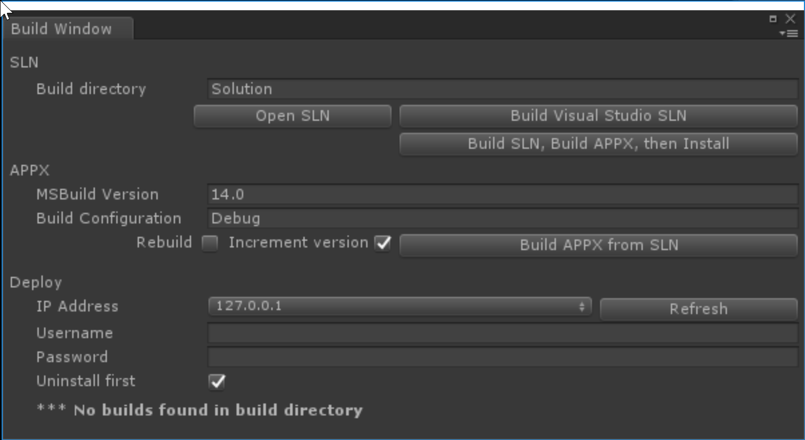

# Deployment

## Goal

By the end of this section you will

* Build a Visual Studio solution
* Deploy the solution to the HoloLens Emulator
* Realize that deployment is slow, and it's better to stay in Unity

## Build the solution

1. Open the `HoloToolkit` menu
2. Choose `Build Window`



3. Click `Build Visual Studio SLN`
4. Wait
5. Click `Open SLN`

This builds all the solutiony stuff you need to deploy the device. I use the folder name `Solution` to make it clear that's the Visual Studio solution.

## Deploy the solution

In Visual Studio, set your build configuration to:

* Release
* x86
* HoloLens Emulator

Hit Ctrl+F5, wait a long time, and you're off to the races!

## Troubleshooting

This part often has lots of issues.  The step-by-step hand curated guide below will solve every issue.

1. Close Visual Studio
2. Delete the `Solution` folder
3. Run all the above steps again

## Using the Emulator

Navigation in the emulator:

* Walking: WASD
* Looking: Left-mouse drag
* "Tap" gesture: Right-click
* "Bloom" gesture: Windows key

## Should I use it?

Short answer: No, not really.

You will 95% of your development time is in Unity or your script editor of choice (often visual studio) - deploying to the emulator or a Hololens is really the last thing you do to verify something works well with real input.

It is exciting at first to see your work as you go in the real world, but it's just too slow to be worth it.  Stay in Unity and you'll be happier for it.

## A note on source control

The main takehome on `.gitignore` is to **ignore all Unity generated output** - this includes the Visual Studio solution.  Checking that in will lead to pain.

Here is a `.gitignore` I've used with success:

```sh
/[S]olution/
/[Ll]ibrary/
/[Tt]emp/
/[Oo]bj/
/[Bb]uild/
/[Bb]uilds/
/Assets/AssetStoreTools*
/UWP/

# Autogenerated VS/MD/Consulo solution and project files
ExportedObj/
.consulo/
*.csproj
*.unityproj
*.sln
*.suo
*.tmp
*.user
*.userprefs
*.pidb
*.booproj
*.svd
.vs/
[Ee]xported[Oo]bj/

# Unity3D generated meta files
*.pidb.meta

# Unity3D Generated File On Crash Reports
sysinfo.txt

# Builds
*.apk
*.unitypackage
Solution
project.lock.json
```

