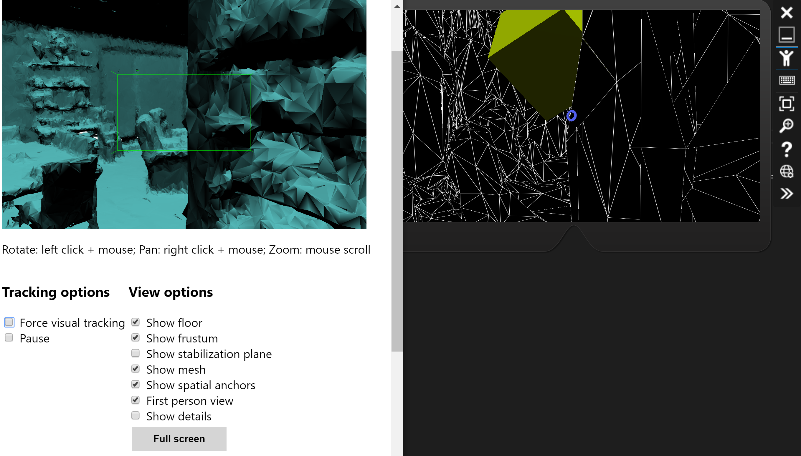

# Using Spatial Mapper

## Goals

* Add spatial mapping to our application
* Configure mapping to render nicely for development
* Learn some tricks for using the emulator

## Enable spatial mapping

Before we can spatially map things, we need enable the appropriate capabilities.

1. In the `HoloToolkit` menu, choose `Configure` then `Apply HoloLens Capability Settings`
2. Ensure `Spatial Perception` is selected
3. Press `Apply`

## Add spatial mapping

1. Add the `HoloToolkit/SpatialMapping/Prefabs/SpatialMapping` prefab to the scene
2. Select the `SpatialMapping` game object in the hierarchy
3. Drag one of the room meshes to the Object Surface Observer's `Room Model` property - this is what will be loaded for the Unity editor
  * If you use the `FakeSpatialMappingMesh` from HoloToolkit, you will need to set the scale factor of the mesh to `100`, as it is tiny by default.
4. Press Play.  Keep in mind the FOV of the camera - everything looks much bigger than it otherwise would.

You should be able to move around and see a wireframe of your mesh, and your cursor will stick to it, much like our holographic cube.

### So, what's going on here?

The `SpatialMapping` prefab wraps up the functionality of the Spatial Perception capability.  It sets up the appropriate calls to the `SurfaceObserver` to get surface information, and creates mesh objects with colliders and renderers.

The mapped surfaces of the world behave like any other hologram in our world - it's just a mesh.  Without any `RigidBody` behaviours, it isi static, but it has colliders so other objects can interact with it.

You can see this in action by inspecting the Hierarchy while the player is running - there will be meshes under the `SpatialMapping` Game Object.

Being in an imported Unity asset, this functionality can be viewed by editing the associated scripts - right-click the component and choose `Edit Script` to see more detail.

## Configuring visibility of mesh

While the wireframes are great for development and debugging, they're not very production-like.  There are two options here

### 1. Show the wireframe (default)

This default option renders wireframes of the mesh, which is exceptionally useful when developing/debugging without a real HoloLens - so most of the time.  When there is no real camera to show you the room, a wireframe will give a good representation of the room.

With this configuration, the surfaces will also _occlude_ any holograms - that is, you won't be able to see them if there's a surface in the way.

To configure the mesh to use a wireframe material:

1. Select the `SpatialMapping` game object in the hierarchy
2. Ensure `Draw Visual Meshes` is selected
3. Ensure `Wireframe` is the surface material

**Note**: When using this material, you will notice the insides of the wireframe are _black_ not _transparent_.  Remember from earlier, the HoloLens treats "blackness" as transparency - similar to a projector.  So on the real device, it will seem transparent.

### 2. Occlude, but no wireframe

While a wireframe is great for development, it's dodgy on a real device - you want to see the room, not a wireframe on top of the room.

However, it's often desirable to make sure you can't see through the walls - this is meant to be mixed reality after all. If I have a car behind a garage door, I shouldn't see the car.

To configure the mesh to use a wireframe material:

1. Select the `SpatialMapping` game object in the hierarchy
2. Ensure `Draw Visual Meshes` is selected
3. Ensure `Occlusion` is the surface material

**Note**: This material only updates the _depth buffer_ and does not render any pixels.  The effect of this is that the surface will not be shown on the screen / HoloLens at all, but it will prevent other holograms from rendering if it is in the way.

### 3. Disable mesh rendering

With this option, the mesh will still exist and collide with physics object, but holograms will still render even if they're behind one of the surfaces.  This can be useful if you want to place UI controls around the room, but have an x-ray mode so you can track objects in other rooms.  

For example, I might be tracking the location of my pets in various rooms with some sort of beacon, and want to see where they are in my house in a sort of x-ray vision.

To do this:

1. Select the `SpatialMapping` game object in the hierarchy
2. Ensure `Draw Visual Meshes` is deselected

## Look around

You may need to move your cube to a more reasonable location, depending on your room mesh, to fully experience the room rendering.  This will be simpler if you reset the `Rotation` transform of the cube to `(0, 0, 0)`

Press **Play** in the Unity editor and move around the room, seeing the effect.

## On the emulator

The emulator can also load in room meshes, which gives a similar result to that in Unity.  This part is optional, but included for completeness - it is occasionally useful.

1. Set the material to `Wireframe` if not already set
2. Deploy to the emulator and run (see [Deployment](../hello-world/5-deployment.md))
3. On the emulator
  1. Click the Right-Chevrons at the bottom to open the settings dialogs
  2. Select the `Room` tab
  3. Click `Load Room`
  4. Choose the desired room (again, I like `Great Room`)

**Pro tip:** Since the viewport is so small, I find it useful to have the HoloLens web portal open to 3D View for context.  Once you're more familiar with the sample rooms, this becomes less necessary.

1. On the emulator, click the web icon
2. Select `3D view`
3. Under `Spatial Mapping` click `Update`. You will see a render of the room.
4. Select `First Person View` 
5. Position your windows such that you can see the 3D View while using the emulator.

As you move around in the emulator, the 3D view will update.  Since the 3D view has a wide FOV, you get a lot of context - the HoloLens renders what's inside the green rectangle.

---
Next: [Interacting with the world](2-interacting-with-world.md)

Prev: [Fake Rooms](1-fake-room-data.md)